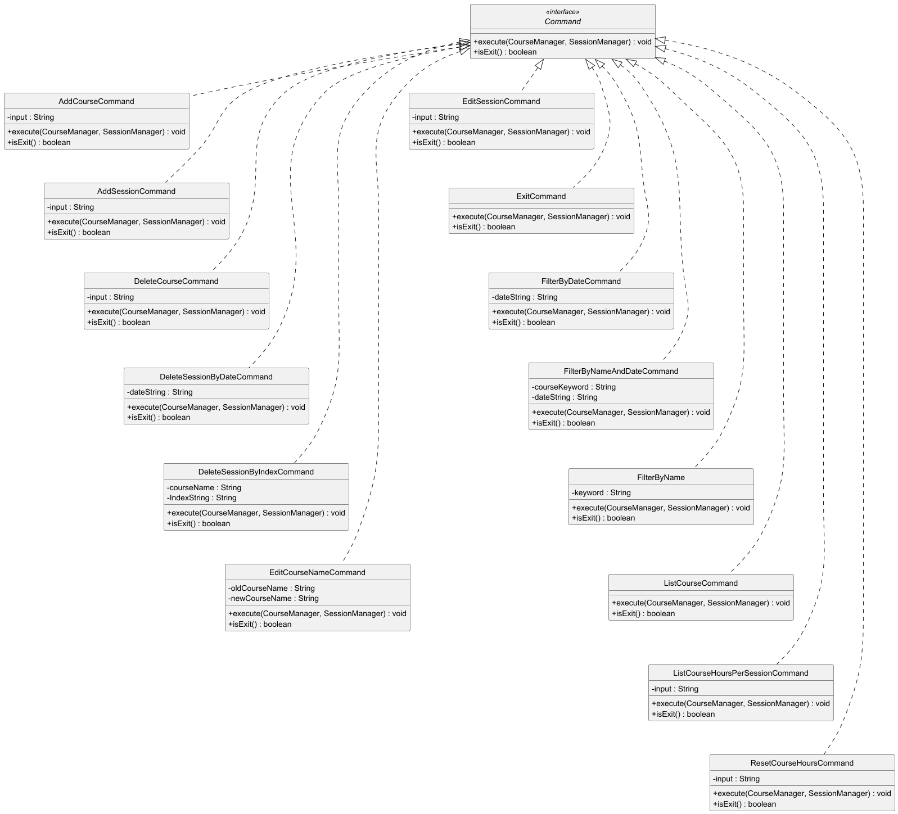
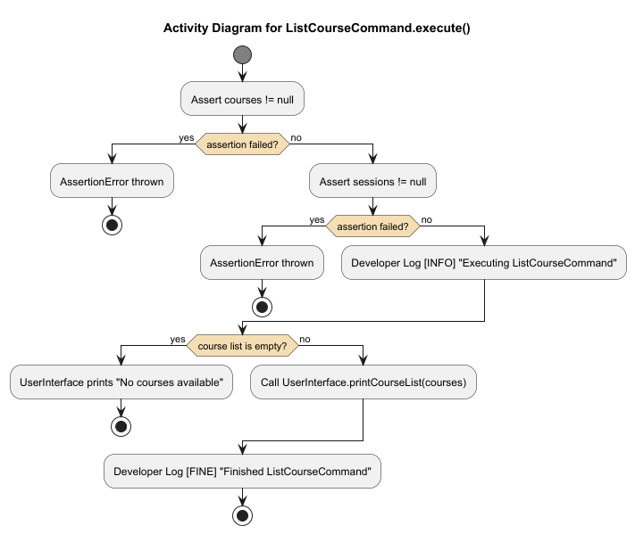
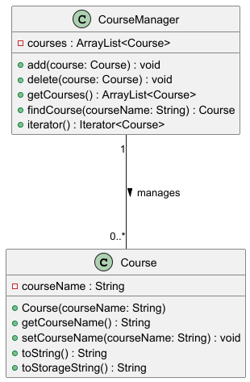
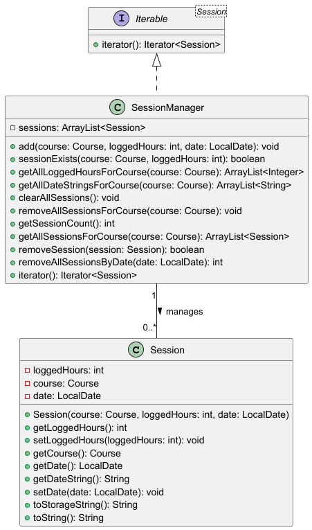
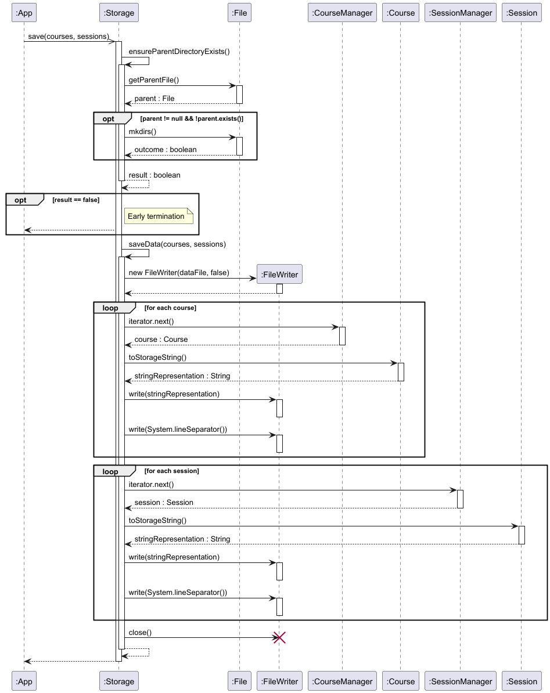
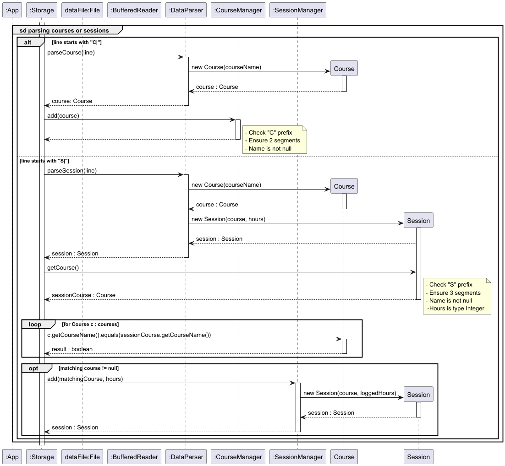

# Developer Guide

## Table of contents

- [**Acknowledgements**](#acknowledgements)
- [**Design & implementation**](#design--implementation)
    - [UI component](#ui-component)
    - [Parser component](#parser-component)
    - [Command component](#command-component)
    - [Course component](#course-component)
    - [Session component](#session-component)
    - [Storage component](#storage-component)
    - [Reset component](#reset-component)
- [**Appendix: Requirements**](#appendix-requirements)
    - [Product scope](#product-scope)
        - [Target user profile](#target-user-profile)
        - [Value proposition](#value-proposition)
    - [User stories](#user-stories)
    - [Use cases](#use-cases)
    - [Non-functional requirements](#non-functional-requirements)
    - [Glossary](#glossary)
- [**Appendix: Instructions for manual testing**](#appendix-instructions-for-manual-testing)

## Acknowledgements

NUStudy uses the following tools for development and testing:

- [JUnit 5](https://junit.org/junit5/) — For unit testing
- [Gradle](https://gradle.org/) — For build automation
- [PlantUML](https://plantuml.com/) — For creating UML diagrams

## Design & implementation

### UI component

### Parser component

### Command component

<u>Overview</u>

The command component is centered on the `Command` interface which defines an execution contract for all commands.
Each command implements this interface and provide its own specific execution logic. This ensures consistent behaviour
across commands.

<u>Implementation details</u>

The following diagram is the class diagram for `Command` and its subclasses.



The `Command` interface is implemented by the following command classes:

- **Add Commands**: `AddCourseCommand`, `AddSessionCommand`
- **Delete Commands**: `DeleteCourseCommand`, `DeleteSessionByDateCommand`, `DeleteSessionByIndexCommand`
- **Edit Commands**: `EditCourseNameCommand`, `EditSessionCommand`
- **List Commands**: `ListCourseCommand`, `ListCourseHoursPerSessionCommand`
- **Other Commands**: `ResetCourseHoursCommand`, `ExitCommand`

<u>Methods</u>

The `Command` interface defines the following methods:

- `execute(CourseManager courses, SessionManager sessions)`: Executes the specific command logic. Takes the course and
  session managers as parameters to perform operations. Throws `NUStudyException` if execution fails.
- `isExit()`: Returns a boolean indicating whether the command is an exit command.

The following sections provide detailed examples of specific command implementations to illustrate how the `Command`
interface is used in practice.

#### List course command

<u>Overview</u>

`ListCourseCommand` is a concrete implementation of the `Command` interface that lists all courses managed by
`CourseManager`. It performs basic sanity checks, logs its actions, and delegates the rendering of the course list to
`UserInterface`.

<u>Implementation details</u>

- Package: `arpa.home.nustudy.command`
- Class: `public class ListCourseCommand implements Command`

Dependencies:

| Component          | Responsibility                                          |
|--------------------|---------------------------------------------------------|
| `CourseManager`    | Provides the collection of courses to be listed.        |
| `SessionManager`   | Present for consistency with command signature.         |
| `UserInterface`    | Renders the course list or an appropriate message.      |
| `NUStudyException` | Thrown if listing fails (not expected in current impl). |
| `Logger`           | Records info/fine level logs for tracing execution.     |

<u>Workflow</u>

The activity diagram below illustrates the `ListCourseCommand.execute()` flow:



Key steps:

- Assert non-null arguments (both `courses` and `sessions`) to catch programming errors early.
- Log the start of command execution at INFO level.
- If the course list is empty, prompt the user with "No courses available" and stop.
- Otherwise, invoke `UserInterface.printCourseList(courses)` to render the list.
- Log completion at FINE level and return.

Notes:

- The assertions are defensive checks intended for development/testing (enabled with `-ea`). Production callers should
  ensure valid arguments.

#### Delete course command

<u>Overview</u>

`DeleteCourseCommand` is a concrete implementation of the `Command` interface in the NUStudy system. The primary
function is to handle user requests to delete an existing course by its name from the courses `ArrayList` managed by
the `CourseManager`.

This command does the following:

- Validate the user input
- Searches for the specified course
- Removes it from the internal course list if found
- Performs consistency checks post-deletion
- Logs all major steps and errors for traceability
- Displays a confirmation message to the user

<u>Implementation details</u>

- Package: `arpa.home.nustudy.command`
- Class: `public class DeleteCourseCommand implements Command`

Dependencies:

| Component                      | Responsibility                                                            |
|--------------------------------|---------------------------------------------------------------------------|
| `CourseManager`                | Manages the list of existing courses, including lookup and deletion.      |
| `SessionManager`               | Provided for command consistency, though not used directly in this class. |
| `UserInterface`                | Displays confirmation messages to the user.                               |
| `Storage`                      | Used as a reference for the logger name.                                  |
| `NUStudyException`             | Thrown for invalid inputs or deletion failures.                           |
| `NUStudyNoSuchCourseException` | Thrown when the specified course does not exist.                          |
| `Logger`                       | Provides runtime logging for debug, info, and error tracking.             |

<u>Workflow</u>

The following activity diagram illustrates the complete removing course workflow:


### Course component

<u>Overview</u>

The Course component is responsible for representing and managing course-related entities in the NUStudy application.
It consists of 2 main classes:

1. `Course` — a class that encapsulates all information about a Course.
1. `CourseManager` — a class that manipulates and maintains a collection of Course objects.

These 2 classes forms the layer for handling the entity of Course. It is responsible for the CRUD of the entity Course.

<u>Implementation details</u>

The following diagram is the class diagram for `Course` and `CourseManger`:



The `CourseManager` class acts as a controller or manager, handling a dynamic list of Course instances using an internal
ArrayList.

**`Course` methods**:

The `Course` class defines the following methods:

- `Course(String courseName)`: Constructs a new Course with the given name.
- `getCourseName()`: Retrieves the name attribute of a Course.
- `setCourseName(String courseName)`: Updates the course name of a Course used for the edit feature.
- `toString()`: Returns the course name as a readable string.
- `toStorageString()`: Returns the course data formatted for file storage.

**`CourseManager` methods**:

The `CourseManager` class defines the following methods:

- `add(Course course)`: Adds a Course Object to the list.
- `delete(Course course)`: Removes a Course Object from the list.
- `getCourses()`: Retrieves all courses managed by this class.
- `findCourse(String courseName)`: Searches for a course by name.
- `iterator()`: Returns an iterator to traverse through all courses.

### Session component

<u>Overview</u>

The session component is responsible for representing a study session, and managing the list of existing study sessions.

It consists of 2 main classes:

1. `Session` — responsible for representing a study session, which consists of the study session's logged hours, the
   course studied, and the date of the study session
1. `SessionManager` — responsible for managing the list of existing study sessions, and contains helper methods to
   query the list of existing study sessions

<u>Implementation details</u>

The following is the class diagram for `Session` and `SessionManager`:



The `SessionManager` class acts as a controller or manager, keeping track of a dynamic list of `Session` instances
using an internal `ArrayList`.

**`Session` methods**:

The `Session` class defines the following methods:

- `Session(Course course, int loggedHours, LocalDate date)`: Create a new Course with the specific name
- `getLoggedHours()`: Get logged hours for this session
- `setLoggedHours(int loggedHours)`: Set logged hours for this session
- `getCourse()`: Get course for this session
- `getDate()`: Return the date of the session
- `getDateString()`: Return a formatted string representation of the date
- `setDate(LocalDate date)`: Set the date of teh session
- `toStorageString()`: Return a string representation to be stored in the data file
- `toString()`: Return a string representation of the course

**`SessionManager` methods**:

The `SessionManager` class defines the following methods:

- `add(Course course, int loggedHours, LocalDate date)`: Add a study session to the list of study sessions
- `sessionExists(Course course, int loggedHours)`: Return true if the given course and logged hours exist in the list of
  study sessions
- `getAllLoggedHoursForCourse(Course course)`: Get a list of all logged hours for a specific course
- `getAllDateStringsForCourse(Course course)`: Get a list of all dates for a specific course
- `clearAllSessions()`: Clear all study sessions regardless of course from study session list
- `removeAllSessionsForCourse(Course course)`: Remove all study sessions associated with the given course
- `getSessionCount()`: Return the number of sessions in the study session list
- `getAllSessionsForCourse(Course course)`: Get a list of all study sessions for a specific course
- `removeSession(Session session)`: Remove a specified session from the study session list
- `removeAllSessionsByDate(LocalDate date)`: Remove all study sessions on a specified date
- `iterator()`: Return an iterator to the list of study sessions

### Storage component

<u>Overview</u>

The `Storage` class is responsible for managing the saving and loading of Course and Study Session to and from the
local machine. NUStudy will load the saved data from the saved txt file if present when starting the application, and
saving all data back to the saved txt file when application exits.

<u>Implementation details</u>

The Storage component consists of the following key classes:

- `Storage` — Main class that handles file I/O operations for saving and loading data
- `Course` — Represent a course with a name, provides serialisation via `toStorageString()`
- `Session` — Represents a study session linked to a course with logged hours, provides serialisation via
  `toStorageString()`
- `CourseManager` — Manages the collection of courses
- `SessionManager` — Manages the collection of study sessions

The class diagram below illustrates the relationships between these classes:


<u>File format and conventions</u>

`Storage` creates a `NUStudy.txt` in the directory `./data` when the application first run and performs a save
operation. Subsequent runs of the application will load data from this file.

The storage file is lined-based, with each line representing a single record:

**Format**:

```
C|<courseName>
S|<courseName>|<loggedHours>
```

Where:

- `C|` prefix denotes a Course record
- `S|` prefix denotes a Session record
- Fields are separated by the pipe character `|`
- `<courseName>` is the course identifier
- `<loggedHours>` is an integer representing study hours

**Examples**:

```
C|CS2113
C|MA1508E
S|CS2113|2
S|CS2113|5
S|MA1508E|6
```

This example shows:

- Two courses: CS2113 and MA1508E
- Three study sessions: two for CS2113 (2 hours and 5 hours) and one for MA1508E (6 hours)

<u>Save operation</u>

The following sequence diagram illustrates how data is stored to storage:



<u>Load operation</u>

The following sequence diagrams illustrate how data is loaded from storage:

1. Main load process: Checks for existence of parent directory and text file, creates buffer and handles continuous
   reading in of stored data lines from the text file.
2. Parsing sub-process: Abstracted frame `sd parsing courses or sessions` showcases how each line is interpreted and
   converted into `Course` or `Session` objects.

*Main load sequence diagram for data loading:*


The `load(courses, sessions)` method in `Storage` executes the following:

1. `ensureParentDirectoryexists()` checks for the parent directory. If non-existent, it attempts to create one using 
   `mkdirs()`.
2. If parent directory exists, the existence of the storage file `NUStudy.txt` is checked. If it is non-existent, a 
   note is logged to notify user and empty managers are initialised.
3. A `BufferedReader` is initiailsed to read in contents from the text file line by line.
4. Each line from the file is handed over to a separate sub-process (see below). This sub-process handles checks, 
   `Session` or `Course` object creation and insertion into the respective managers.
5. After all lines are processed, the `BufferedReader` is closed and returns to `App`.

*Referenced sequence diagram for parsing logic:*



The abstracted logic parsing frame executes the following:

1. Based on the line prefix, the `Storage` component assigns parsing logic as shown by the `opt` frame.
   1. If a line starts with `C|`, it calls `parseCourse(line)` through the `DataParser` class, constructs a new 
      `Course` object and inserts it into the `CourseManager` instance.
   2. If a line starts with `S|`, it calls `parseSession(line)` through the `DataParser` class, constructs a 
      new `Session` object with its corresponding `Course` reference and inserts it into the `SessionManager` 
      instance if a matching course already exists.
2. Each parsing branch contains internal validation checks for prefix correctness, segment counts and null checks.

### Reset component

<u>Overview</u>

The reset functionality enables users to clear logged study hours for either all or a specified course. A **double
confirmation flow** is developed to prevent any unintended and thus, accidental deletions.

<u>Implementation details</u>

1. First level confirmation:
    - Users must confirm with `y` or `n` regardless of capitalisation. This prompt loops until valid input is received.
    - If `n` is received, reset operation is cancelled
1. Second level confirmation:
    - Users are to prompted to type the `safeword` — `RESET ALL` for all courses and `RESET` for a specific course
    - The `safeword` must strictly be equivalent, else reset operation is cancelled

<u>Reset workflow</u>

The following activity diagram illustrates the complete reset workflow:


<u>Design considerations</u>

**Aspect: Confirmation mechanism**

- **Alternative 1 (current choice)**: Dual-level confirmation with `safeword`
    - Pros: By strictly requiring the user to clarify his/her final intent, this ensures maximum prevention in
      accidental deletion
    - Cons: Slower user experience due to increased user interaction
- **Alternative 2**: Single-level confirmation
    - Pros: Quicker user experience, straightforward design
    - Cons: Greater risk of accidental data wipe, especially for `reset all` usage
- **Alternative 3**: Zero confirmation
    - Pros: Quickest operation, minimal required user interaction
    - Cons: Reckless design, leading to unacceptable risk of data wipe

{*more aspects and alternatives to be added*}

## Appendix: Requirements

### Product scope

#### Target user profile

- Prefer desktop apps over other types
- Can type fast
- Prefers typing to mouse interactions
- Is reasonably comfortable using CLI apps
- Undergraduate students who want a simple, keyboard-driven tool to track study time per course
- Teaching assistants / tutors who inspect or maintain small course logs
- Single-user administrators managing personal or small-group study records
- Intended for small-to-moderate datasets (tens to low hundreds of courses/sessions)

#### Value proposition

Helps students to track their study hours for each course, see gaps and understand what courses to focus on next.
Students often struggle to manage study time across multiple courses, leading to missed deadlines. Existing tools can be
distracting, requiring internet access, or bloated with unnecessary features.

### User stories

Priorities: High (must have) - `* * *`, Medium (nice to have) - `* *`, Low (optional) - `*`

| Priority | As a…                     | I want to…                                                                    | So that I can…                                                   |
|----------|---------------------------|-------------------------------------------------------------------------------|------------------------------------------------------------------|
| `* * *`  | Easily distracted student | access the study app offline                                                  | be less distracted                                               |
| `* * *`  | Careless student          | be asked for confirmation when I want to delete study sessions                | be rest assured there won’t be any accidental deletions          |
| `* * *`  | Goal-oriented student     | set goals for total study hours per day                                       | I can track short-term progress                                  |
| `* * *`  | Goal-oriented student     | set target study hours per course                                             | set my goals clear                                               |
| `* * *`  | Organised student         | add a new course                                                              | track number of hours required for it                            |
| `* * *`  | Organised student         | log study time spent for a specific course                                    | keep track of the amount of time spent studying per module       |
| `* * *`  | Organised student         | remove a course                                                               | keep my study list relevant                                      |
| `* * *`  | Visual learner            | be given proper feedback as I manipulate stuff (CRUD)                         | be visually stimulated and be informed of my actions             |
| `* * *`  | Organised student         | reset logged hours                                                            | know what to focus on next                                       |
| `* * *`  | Diligent student          | rank the course study time                                                    | start fresh for a current course                                 |
| `* * *`  | Inquisitive student       | see which course I studied the least                                          | know where to focus more                                         |
| `* * *`  | Efficient student         | set maximum study hours allocated in a week                                   | effectively balance my workload across the week                  |
| `* * *`  | Reflective student        | track total studies time                                                      | understand my priorities                                         |
| `* * *`  | Systematic student        | view a summary of hours spent on studying per course                          | have better time management                                      |
| `* *`    | Ambitious student         | set long-term study goals for the semester                                    | plan my academic progress                                        |
| `* *`    | Careful student           | edit previous log study time or course                                        | fix typos or mistakes                                            |
| `* *`    | Careful student           | undo my last input                                                            | quickly fix my mistakes                                          |
| `* *`    | Disciplined student       | set weekly study goals                                                        | maintain a consistent study routine                              |
| `* *`    | Efficient student         | filter my study logs by date                                                  | focus on specific periods                                        |
| `* *`    | Persistent student        | track my study streak                                                         | stay motivated to study daily                                    |
| `* *`    | Motivated student         | earn badges/points for consistent study habits                                | stay engaged with the app                                        |
| `* *`    | New user                  | view a manual on how to use this app                                          | quickly learn how to use its features                            |
| `* *`    | Organised student         | view a calendar of all my course events                                       | plan my study schedule                                           |
| `* *`    | Proactive student         | see a summary of my course deadlines                                          | prioritize tasks effectively                                     |
| `* *`    | Attentive student         | compare actual versus target hours                                            | know if I am on track                                            |
| `* *`    | Methodical student        | have an automatic way to log my study times per session                       | do not have to be aware and concerned if I forgot to time myself |
| `* *`    | Thorough student          | have my study timing records saved automatically                              | be sure my progress will not be lost                             |
| `* *`    | Resilient student         | have the option to import past study sessions if I have the save file with me | continue where I left off                                        |
| `* *`    | Analytical student        | track my average study hour per day                                           | I can evaluate my consistency                                    |
| `*`      | Busy student              | receive notifications for upcoming assignment deadlines                       | manage my time effectively                                       |
| `*`      | Competitive student       | compare my study hours with anonymized peer data                              | gauge my effort                                                  |
| `*`      | Responsible student       | confirm my assignment submissions                                             | I know they were received successfully                           |
| `*`      | Time-conscious student    | set personal reminders for study tasks                                        | stay on top of my coursework                                     |

## Use cases

<u>UC1 — Add course (MSS)</u>

1. User issues: `add <course>`
1. System validates and adds course
1. System confirms addition; `list` shows it

Extensions: missing/invalid input → system prompts; duplicate → system rejects

<u>UC2 — Add study session (MSS)</u>

1. User issues: `add <course> <hours> [date]`
1. System validates course existence, hours and date
1. System records session and confirms

Extensions: invalid course/date/hours → system shows error

<u>UC3 — List courses / sessions (MSS)</u>

1. User issues: `list` or `list <course>`
1. System displays courses or sessions with 1-based indices

Extensions: no data → empty message

<u>UC4 — Edit session (MSS)</u>

1. User issues: `edit <course> <index> <hours|date>`
1. System validates inputs and updates session
1. System confirms update

Extensions: invalid course/index/date → system shows error

<u>UC5 — Filter (MSS)</u>

1. User issues: `filter <course>` or `filter <date>` or `filter <course> <date>`
1. System validates inputs and displays matching results
1. System retains original course/session indices in output to support subsequent edit/delete by index

Extensions: invalid/ future dates → informative error; no matches → empty message

<u>UC6 — Reset hours (MSS)</u>

1. User issues: `reset <course>` or `reset all`
1. Two-stage confirmation (y/n, then safeword)
1. On confirmation, system resets hours and confirms

### Non-functional requirements

#### Data

- NFR1: Persist data across sessions to local file; no data loss on normal shutdown
- NFR2: Handle typical dataset sizes (hundreds of entries) with responsive performance

#### Environment

- NFR3: Run on mainstream OSes with Java 17+

#### Usability & accessibility

- NFR4: Clear, actionable error messages for invalid input (dates, indices, missing args)
- NFR5: Keyboard-first UX; minimal typing overhead for common tasks

#### Maintainability & testability

- NFR6: Modular design (parser, UI, commands, managers) to ease maintenance

#### Reliability & robustness

- NFR7: Fail gracefully on malformed storage lines (log and skip), validate dates (reject future dates) and indices

#### Performance

- NFR8: Typical command response time under 2 seconds for up to hundreds of records

#### Scalability

- NFR9: Design permits scaling storage or migrating to DB if needed (out-of-scope for MVP)

### Glossary

- Mainstream OS: Windows, Linux, Unix, MacOS
- MSS: Must-Support Scenario
- NUStudy: The name of the application
- CLI: Command-Line Interface
- Course: A study subject identified by a course code (e.g., CS2113, MA1511)
- Session: A recorded study period linked to a Course, with logged hours and a date
- Index (course): 1-based position of a course in the CourseManager's list (used for edit/delete)
- Index (session): 1-based position of a session in a course's session list (used for edit/delete)
- Future date: A date strictly after the system's current date; commands validate and report this
- Safeword: Exact confirmation string required for destructive operations (e.g., `RESET`, `RESET ALL`)

## Appendix: Instructions for manual testing

- Technical Requirements:

  - Ensure you have Java 17+ installed on your computer. If you do not have JRE 17 installed, you can [download Temurin JRE 17](https://adoptium.net/temurin/releases?version=17&os=any&arch=any).

### Manual testing of features

Please refer to the [User Guide](UserGuide.md) for the full list of features and instructions on how to use them.

### JUnit testing

JUnit tests are provided for core components of NUStudy. To run the tests, follow these steps:

1. Open a terminal and navigate to the root directory of the project.

1. Run the following command to execute the tests:

  - On Windows:

  ```
    gradlew.bat test
  ```

  - On macOS/Linux:
  
   ```
   ./gradlew test
   ```

3. Review the test results in the terminal output.
