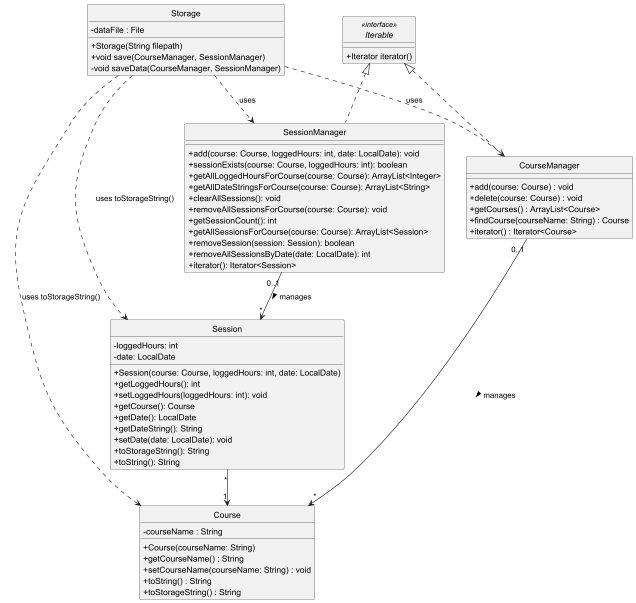
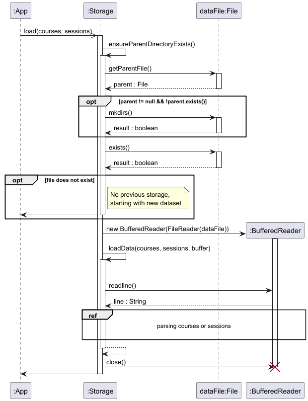

# Developer Guide

## Acknowledgements

{list here sources of all reused/adapted ideas, code, documentation, and third-party libraries -- include links to the
original source as well}

## Design & implementation

### Storage Component

<u>Overview</u>

The `Storage` class is responsible for managing the saving and loading of Course and Study Session to and from the
local machine. NUStudy will load the saved data from the saved txt file if present when starting the application, and
saving all data back to the saved txt file when application exits.

<u>Implementation Details</u>

The Storage component consists of the following key classes:

* `Storage` - Main class that handles file I/O operations for saving and loading data
* `Course` - Represent a course with a name, provides serialisation via `toStorageString()`
* `Session` - Represents a study session linked to a course with logged hours, provides serialisation via
  `toStorageString()`
* `CourseManager` - Manages the collection of courses
* `SessionManager` - Manages the collection of study sessions

The class diagram below illustrates the relationships between these classes:



<u>File format and conventions</u>

`Storage` creates a `NUStudy.txt` in the directory `./data` when the application first run and performs a save
operation. Subsequent runs of the application will load data from this file.

The storage file is lined-based, with each line representing a single record:

**Format**

```
C|<courseName>
S|<courseName>|<loggedHours>
```

Where:

- `C|` prefix denotes a Course record
- `S|` prefix denotes a Session record
- Fields are separated by the pipe character `|`
- `<courseName>` is the course identifier
- `<loggedHours>` is an integer representing study hours

*Examples*

```
C|CS2113
C|MA1508E
S|CS2113|2
S|CS2113|5
S|MA1508E|6
```

This example shows:

- Two courses: CS2113 and MA1508E
- Three study sessions: two for CS2113 (2 hours and 5 hours) and one for MA1508E (6 hours)

<u>Save Operation</u>

The following sequence diagram illustrates how data is stored to storage:


<u>Load Operation</u>

The following sequence diagram illustrates how data is loaded from storage:



How the `load` operation work:

1. `ensureParentDirectoryexists()` checks for the parent file. An error message is logged and returns `false` if 
   non-existent.
2. If parent directory exists, storage file existence is checked. If `exists()` on the storage file returns false, 
   empty dataset is initialised. Else, data is loaded in.
3. Data is parsed in line by line using `nextLine()`. Lines with prefix `C|` are parsed as courses with `parseCourse
(line)` while lines with prefix `S|` are parsed as sessions with `parseSession(line)`.
4. Every line is validated in the format variables (prefix, number of segments, non-null values). For sessions, the 
   referenced course must exist in the corresponding `CourseManager` instance.
5. Warnings are logged for invalid lines - such lines are skipped.
6. Only valid courses and sessions are added to the `CourseManager` and `SessionManager` instances respectively.

### Reset Component ###

<u> Overview </u>

The Reset Functionality enables users to clear logged study hours for either all or a specified course. A **double 
confirmation flow** is developed to prevent any unintended and thus, accidental deletions.

<u> Implementation details </u>

1. First Level Confirmation:
- Users must confirm with `y` or `n` regardless of capitalisation. This prompt loops until valid input is received
- If `n` is received, reset operation is cancelled
2. Second Level Confirmation:
- Users are to prompted to type the `safeword` - `RESET ALL` for all courses and `RESET` for a specific course
- The `safeword` must strictly be equivalent, else reset operation is cancelled

<u> Reset Workflow </u>

The following activity diagram illustrates the complete reset workflow:


<u> Design Considerations </u>

**Aspect: Confirmation mechanism**

* **Alternative 1 (current choice)**: Dual-level confirmation with `safeword`
  * Pros: By strictly requiring the user to clarify his/her final intent, this ensures maximum prevention in 
    accidental deletion
  * Cons: Slower user experience due to increased user interaction
* **Alternative 2**: Single-level confirmation
  * Pros: Quicker user experience, straightforward design
  * Cons: Greater risk of accidental data wipe, especially for `reset all` usage
* **Alternative 3**: Zero confirmation
  * Pros: Quickest operation, minimal required user interaction
  * Cons: Reckless design, leading to unacceptable risk of data wipe

{*more aspects and alternatives to be added*}
## Product scope

### Target user profile

{Describe the target user profile}

### Value proposition

{Describe the value proposition: what problem does it solve?}

## User Stories

| Version | As a ... | I want to ...             | So that I can ...                                           |
|---------|----------|---------------------------|-------------------------------------------------------------|
| v1.0    | new user | see usage instructions    | refer to them when I forget how to use the application      |
| v2.0    | user     | find a to-do item by name | locate a to-do without having to go through the entire list |

## Non-Functional Requirements

{Give non-functional requirements}

## Glossary

* *glossary item* - Definition

## Instructions for manual testing

{Give instructions on how to do a manual product testing e.g., how to load sample data to be used for testing}
